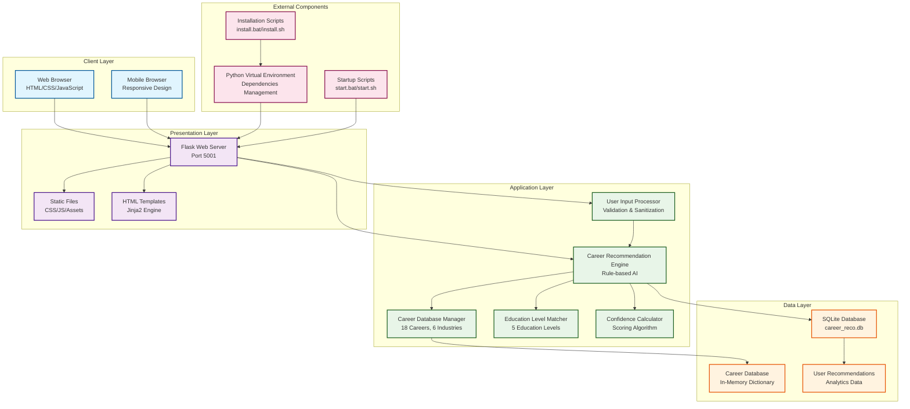
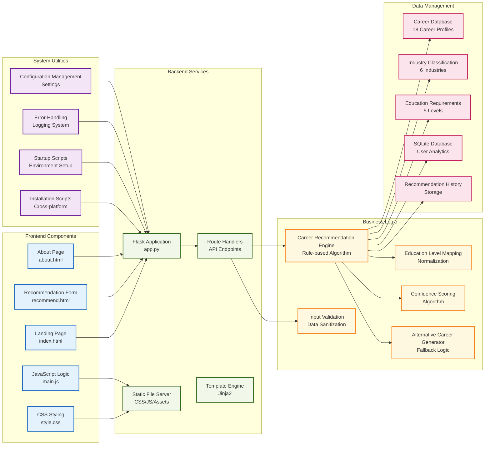
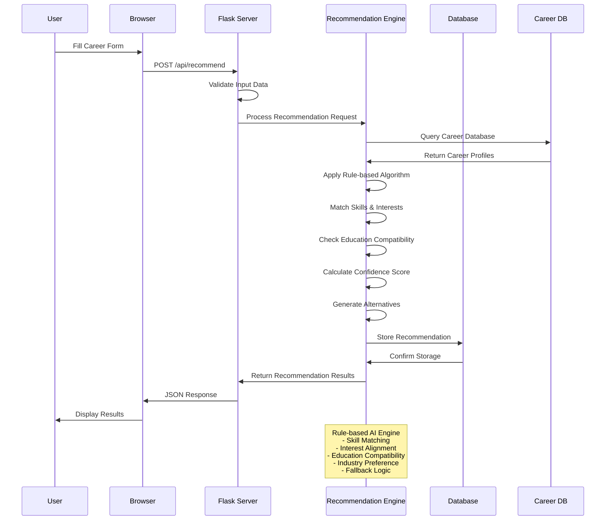
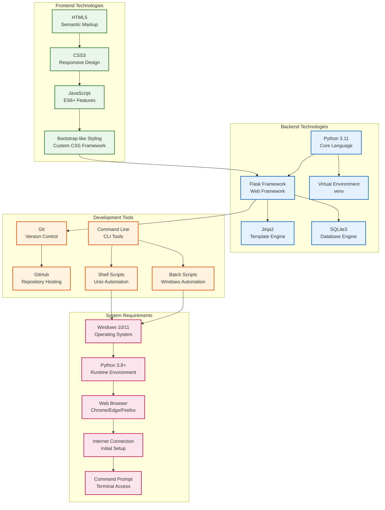
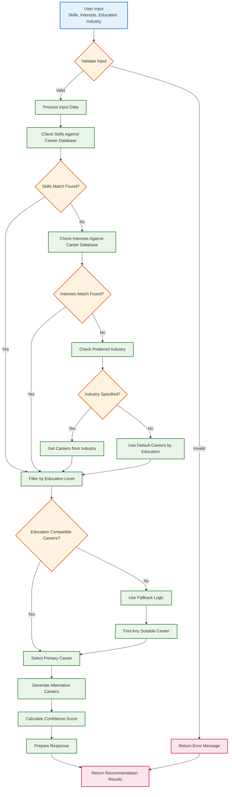
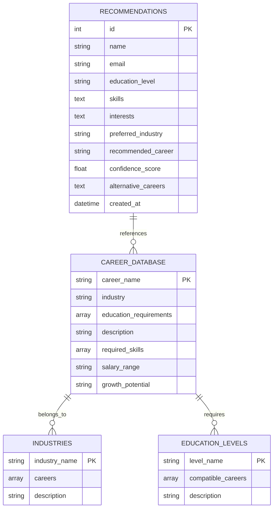
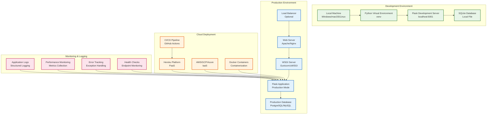
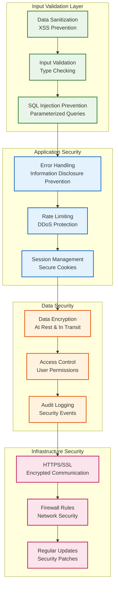
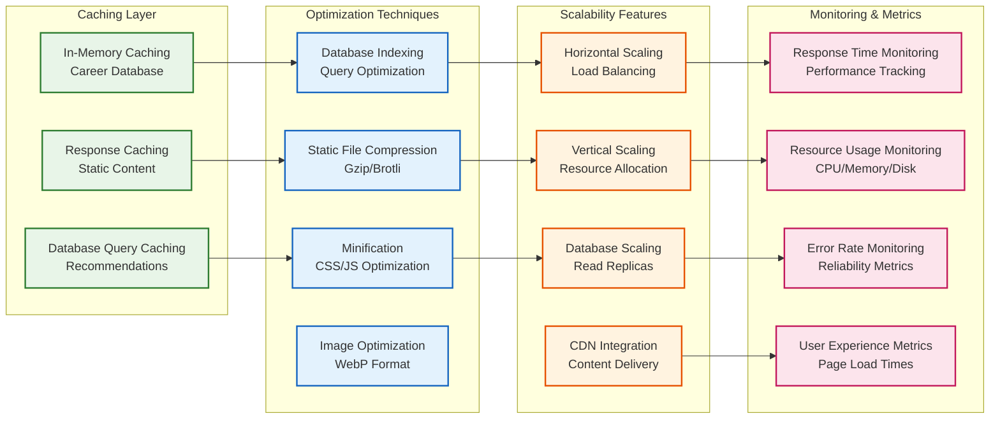

# System Architecture: AI-Powered Career Recommendation System

## High-Level System Architecture

## Detailed Component Architecture

## Data Flow Architecture

## Technology Stack Architecture

## Career Recommendation Algorithm Flow

## Database Schema Architecture

## Deployment Architecture

## Security Architecture

## Performance Architecture

---

## Architecture Summary

### Key Architectural Components:

1. **Frontend Layer**: HTML5, CSS3, JavaScript with responsive design
2. **Backend Layer**: Flask web framework with Python 3.11
3. **Business Logic Layer**: Rule-based AI recommendation engine
4. **Data Layer**: SQLite database with in-memory career database
5. **Deployment Layer**: Cross-platform installation and startup scripts

### Architectural Patterns:

1. **MVC Pattern**: Model (Career Database), View (HTML Templates), Controller (Flask Routes)
2. **Layered Architecture**: Clear separation between presentation, business logic, and data layers
3. **Rule-based AI**: Deterministic recommendation algorithm with fallback logic
4. **RESTful API**: Standard HTTP endpoints for data exchange

### Scalability Considerations:

1. **Horizontal Scaling**: Stateless application design
2. **Database Optimization**: Indexed queries and caching strategies
3. **Performance Monitoring**: Response time and resource usage tracking
4. **Security Measures**: Input validation, error handling, and data sanitization

This architecture provides a robust, scalable, and maintainable foundation for the AI Career Recommendation System while ensuring ease of deployment and use for end users. 